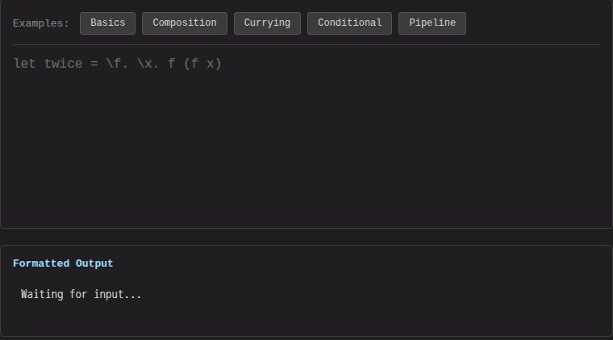

# Canopy

**Write. It structures itself.**



Canopy reads your code as a live structure rather than flat text. As you type, it reparses incrementally, tracks scope and types, evaluates expressions, and formats the result — without breaking your flow. Two people can edit the same document at once with no server, and edits merge automatically.

[Try the live demo](https://canopy-ideal.pages.dev) · [Architecture](docs/architecture/) · [eg-walker paper](https://arxiv.org/abs/2409.14252)

## Why

Most editors treat source code as flat text. You type characters, and the tool does its best to guess what you meant — syntax highlighting, auto-complete, error squiggles — all reconstructed after the fact from dead text.

Canopy treats your program as a living structure. Text and syntax tree are **two synchronized views** of the same document. Type in one, the other updates. Restructure in one, the other follows. The editor doesn't guess what your code means — it knows, because it maintains the meaning incrementally as you type.

The goal: **close the gap between what you think and what the tool understands.** When the editor holds the same mental model you do — scope, types, values, dependencies — it can show you what matters, when it matters, without you having to search for it.

## What it looks like

The demo language is lambda calculus — small enough to understand fully, rich enough to exercise the full pipeline:

```
let double = λx. x + x
let result = double 5
if result then result else 0
```

As you type this, Canopy:
- Parses incrementally (one character change → one subtree reparse)
- Resolves scope (knows `x` is bound by `λ`, `double` refers to the definition above)
- Formats with syntax highlighting through the pretty-printer
- Evaluates `double 5 → 10` and `if result then result else 0 → 10`
- Synchronizes with any connected peer via CRDT

## How It Works

Four stages, each incremental:

```
Text CRDT → Incremental Parse → Projection → Rendering
    ↑                                            │
    └────── structural edits feed back ──────────┘
```

1. **Text CRDT** ([event-graph-walker](event-graph-walker/)) — The document lives in a FugueMax sequence CRDT. All edits — keystrokes, remote operations, undo/redo — enter here. Peers sync directly, no central server.

2. **Incremental parsing** ([loom](loom/)) — Only the affected region is reparsed. Unchanged subtrees are reused from the previous parse through position-independent CST nodes.

3. **Projection** — The syntax tree maps to a projection tree with stable node IDs and source spans. Node identity survives reparses, so UI state (selection, scroll) is preserved.

4. **Rendering** — The protocol layer computes incremental view patches. Only changed nodes reach the frontend. Multiple representations — formatted text, tree view, graph visualization — render from the same projection.

## Quick Start

Requires [MoonBit](https://www.moonbitlang.com/download/) and [Node.js](https://nodejs.org/).

```sh
git clone --recursive https://github.com/dowdiness/canopy.git
cd canopy

# Workspace-root tests (canopy + lib/text-change, lib/zipper, lib/btree, lib/moji).
# Submodules (event-graph-walker, loom, etc.) and example modules have their own
# test suites; see docs/development/monorepo.md for the full fan-out.
moon test

# Build the JS FFI artifacts the web demo expects.
make build-js

# Run the web demo at http://localhost:5173 (lambda editor by default; JSON at
# /json.html, Markdown at /markdown.html).
cd examples/web && npm install && npm run dev
```

The targets currently exercised in CI are **JavaScript** (web demo, FFI) and
**native** (CLI, tests). WebAssembly is not a supported build target — see
`docs/TODO.md`.

## The Bigger Picture

Canopy is a framework as much as an editor. Define a grammar for your language, implement a few traits, and you get incremental parsing, structural editing, pretty-printing, and CRDT collaboration out of the box.

But the long-term vision goes further. The code editor is a vertical slice of something larger: **a system where you write freely, structure emerges automatically, and the right information surfaces when you need it.** Every layer of the editor — incremental computation, semantic analysis, reactive projections, peer-to-peer sync — is a building block for that system.

Read more: [Product Vision](docs/architecture/product-vision.md) · [The Projectional Bridge](docs/architecture/vision-projectional-bridge.md) · [Multi-Representation System](docs/architecture/multi-representation-system.md)

## Framework Design

**Text is ground truth, structure is derived.** The text CRDT stores the document; everything else is computed. This means collaboration operates on a proven data structure, and the pipeline from text to view is a deterministic function of document state.

**Language support is declarative.** Adding a new language means providing a grammar and a projection mapping; the framework handles parsing, reconciliation, undo/redo, and collaboration generically. Lambda calculus and JSON share the same core.

**Multiple representations from one source.** The [Printable trait family](docs/architecture/multi-representation-system.md) (Show, Debug, Source, Pretty) gives every language four text representations. `Source` guarantees `parse(to_source(x)) == x`. `Pretty` produces width-aware, syntax-annotated output. Adding a new text format means writing one render function; the language definition stays untouched.

**Incremental by construction.** Every stage — parsing, projection, rendering — recomputes only what changed. This isn't bolted-on caching; it's the [architectural principle](docs/architecture/Incremental-Hylomorphism.md) the framework is built around.

## Repository Structure

The canopy MoonBit module is at the repository root. Its package layout, plus
in-tree libraries and submodules, is summarised below. See
[docs/architecture.md](docs/architecture.md) for the responsibility map.

**Canopy module — internal packages:**

| Package | Role |
|---------|------|
| [core/](core/) | `NodeId`, `ProjNode[T]`, `SourceMap`, tree-edit primitives |
| [editor/](editor/) | `SyncEditor` — wires CRDT, parser, projection, undo, ephemeral cursors |
| [protocol/](protocol/) | `ViewPatch`, `ViewNode`, `UserIntent` — wire format for the frontend |
| [projection/](projection/) | `TreeEditorState`, interactive tree operations |
| [relay/](relay/) | Byte-buffer relay primitive used by the editor's collaboration path |
| [ffi/](ffi/) | JS FFI surfaces: `ffi/lambda`, `ffi/json`, `ffi/markdown` |
| [lang/lambda/](lang/lambda/) | Lambda calculus — `proj`, `edits`, `eval`, `flat`, `companion` |
| [lang/json/](lang/json/) | JSON projectional editor — `proj`, `edits`, `companion` |
| [lang/markdown/](lang/markdown/) | Markdown projectional editor — `proj`, `edits`, `companion` |
| [llm/](llm/) | Optional LLM client (JS target only); consumed by `ffi/lambda` |
| [cmd/main/](cmd/main/) | Native CLI entry point |
| [echo/](echo/) | Tokenisation engine used by the echo similarity experiment |

The FFI stability surface is intentionally narrow: JS frontends should consume
the editor through [`adapters/editor-adapter`](adapters/editor-adapter/) where
practical.

**Workspace members** (built by `moon test` at the repo root, per `moon.work`):

`./` (canopy), `./lib/text-change`, `./lib/zipper`, `./lib/btree`, `./lib/moji`.

`./lib/semantic` is also in-tree but is not a workspace member; run its tests
separately.

| Library | Purpose |
|---------|---------|
| [lib/btree/](lib/btree/) | Counted B+ tree with O(log n) position-indexed access |
| [lib/moji/](lib/moji/) | Unicode UAX #29 grapheme- and word-boundary segmentation |
| [lib/zipper/](lib/zipper/) | Rose-tree zipper |
| [lib/text-change/](lib/text-change/) | Text-mutation primitives |
| [lib/semantic/](lib/semantic/) | `Confidence[T]` lattice for merging multi-source annotations |

**Git submodules** (separately owned repositories):

| Path | Repository | Role |
|------|------------|------|
| [event-graph-walker/](event-graph-walker/) | `dowdiness/event-graph-walker` | CRDT engine (eg-walker + FugueMax) |
| [loom/](loom/) | `dowdiness/loom` | Incremental parser framework, CST library, reactive signals, pretty-printer |
| [rle/](rle/) | `dowdiness/rle` | Run-length encoded sequence |
| [order-tree/](order-tree/) | `dowdiness/order-tree` | Counted/order-statistic tree |
| [graphviz/](graphviz/) | `dowdiness/graphviz` | Graphviz renderer (used in the inspector) |
| [svg-dsl/](svg-dsl/) | `dowdiness/svg-dsl` | SVG DSL |
| [valtio/](valtio/) | `dowdiness/valtio` | JS state management glue |
| [alga/](alga/) | `dowdiness/alga` | Graph algebra |

**Examples:**

| Example | Description | Live demo |
|---------|-------------|-----------|
| [examples/web/](examples/web/) | Vite frontend hosting the lambda, JSON, and Markdown editors | [canopy-lambda-editor.pages.dev](https://canopy-lambda-editor.pages.dev) |
| [examples/ideal/](examples/ideal/) | Full-featured editor with inspector and benchmarks | [canopy-ideal.pages.dev](https://canopy-ideal.pages.dev) |
| [examples/prosemirror/](examples/prosemirror/) | ProseMirror structural-editing integration | [canopy-prosemirror.pages.dev](https://canopy-prosemirror.pages.dev) |
| [examples/canvas/](examples/canvas/) | Infinite canvas (experimental) | [canopy-canvas.pages.dev](https://canopy-canvas.pages.dev) |
| [examples/block-editor/](examples/block-editor/) | Block-based structural editing | [canopy-block-editor.pages.dev](https://canopy-block-editor.pages.dev) |
| [examples/demo-react/](examples/demo-react/) | Minimal React integration | [canopy-demo-react.pages.dev](https://canopy-demo-react.pages.dev) |
| [examples/relay-server/](examples/relay-server/) | Cloudflare Workers relay (collaboration) | deployed as `canopy-relay` |

A few additional unlisted directories (`examples/rabbita/`, the `memo.html` and
`spike-block-input.html` pages under `examples/web/`) are work-in-progress
spikes; treat them as unstable.

## What to Read Next

Start with the **[Documentation Index](docs/README.md)** — it organizes the rest
of the docs into a learning path, API/reference, and contributor material. The
highlights:

**Vision and architecture:**
- [Product Vision](docs/architecture/product-vision.md) — the full picture: write, auto-structure, surface
- [The Projectional Bridge](docs/architecture/vision-projectional-bridge.md) — why: syntax → semantics → intent → mental model
- [Multi-Representation System](docs/architecture/multi-representation-system.md) — the Printable trait family and expression problem
- [Incremental Hylomorphism](docs/architecture/Incremental-Hylomorphism.md) — the compositional engine underneath

**API / integration:**
- [API Reference](docs/development/API_REFERENCE.md) — high-level MoonBit API
- [JS Integration Guide](docs/development/JS_INTEGRATION.md) — using the editor from JavaScript

**Development:**
- [Development Workflow](docs/development/workflow.md) — how to make changes, run tests, manage submodules
- [Conventions](docs/development/conventions.md) — MoonBit coding patterns
- [TODO](docs/TODO.md) — active backlog

## Contributing

```sh
moon test                    # run all tests
moon info && moon fmt        # update interfaces and format
moon bench --release         # benchmarks (always use --release)
```

See the [Development Guide](docs/development/) for details.

## References

- [Eg-walker: CRDTs for Truly Concurrent Sequence Editing](https://arxiv.org/abs/2409.14252) — the CRDT algorithm
- [MoonBit](https://www.moonbitlang.com/) — the implementation language

## License

[Apache-2.0](LICENSE)
