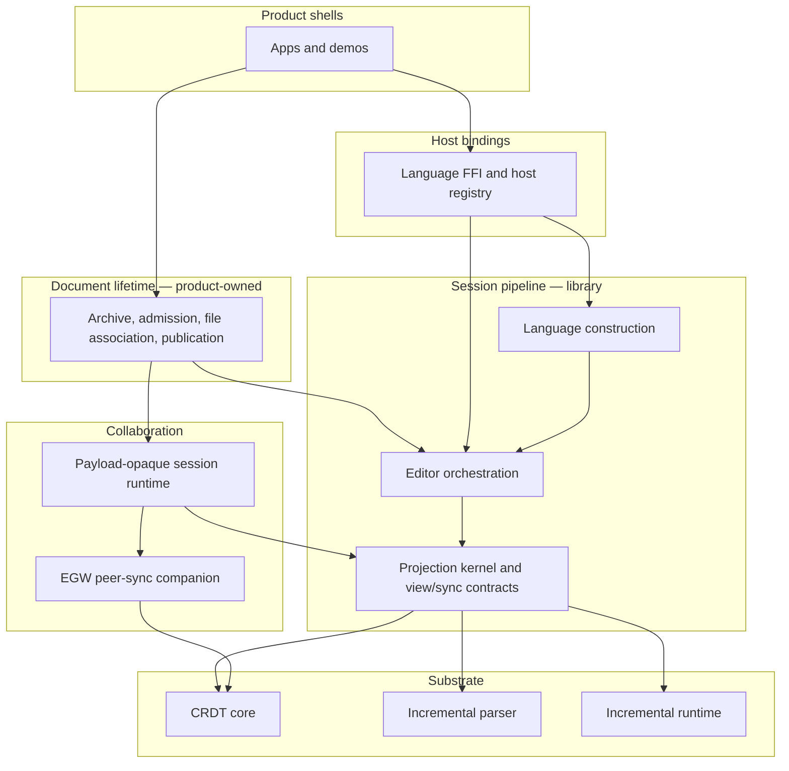

# System architecture

Canopy is three nested architectures, not a single editor façade.

1. **Session pipeline** — one mounted editing session: durable text, incremental
   parse, projection identity, view protocol.
2. **Collaboration** — how replicas exchange causal work without mixing CRDT
   rules, transport, and product policy.
3. **Document authority** — identity and access over time: causal history, file
   association, warm versus cold residency, publication.

The [composition decision](../decisions/2026-08-18-architecture-composition.md)
is the nesting rule. This page is the map. Package inventories live in live
manifests; see the [module/package map](../development/module-package-map.md).

A new ADR must name which of the three architectures it extends, which layer
inside that architecture, and whether the change is shipped behavior or target
architecture. Do not introduce a fourth stack.

## Nesting

Arrows mean "may depend on".



**Declared exception:** language construction may depend on editor
orchestration. Construction order, source identity, identity hints, and watch
coherence belong in one place
([generic language SPI](../decisions/2026-08-07-generic-language-spi-deepening.md)).

**Must not:** collaboration runtime depends on editor orchestration.
Collaboration treats causal payloads as opaque. Relay inspects routing
metadata only
([EGW collaboration boundary](../decisions/2026-07-21-egw-collaboration-responsibility-boundary.md)).

**Must not:** a text snapshot becomes an editing base without causal admission
([causal residency](../decisions/2026-08-12-causal-authority-residency.md)).

## Ownership by reason to change

| Reason to change | Owner | Must not own |
|---|---|---|
| CRDT operations, causal rules, façade codecs, document-local pending replay | CRDT core | Rooms, presence, sockets, product UX |
| Apply-report interpretation, bootstrap and causal-gap recovery commands | EGW peer-sync companion | Sockets, rooms, editor state |
| Connection/session transitions, envelopes, transport backpressure | Payload-opaque collaboration runtime | CRDT merge, presence meaning |
| Network, room routing, access, reconnect, storage providers | Infrastructure | Decoding causal payloads |
| Durable document identity, archive envelope, file association, publication ledger, recovery classification | Document lifetime (product) | CRDT algorithms, parser internals |
| Session orchestration, undo, projection memos, view diffs | Editor orchestration | Sockets, durable identity, language grammar |
| Syntax-specific projection and span edits | Language packages | Transport, global session state |
| Rendering and input translation | Frontend adapters | Parsing, replicated-state semantics |

Document lifetime incubates in the Markdown product until a second app needs
the same envelope. Editor orchestration stays a session library.

## Session pipeline

This is the library loop. It is not the whole system.

```text
Text CRDT ─► Incremental parse ─► Projection ─► View protocol ─► Frontend
   ▲                                                                 │
   └────────────── structural edits become text edits ───────────────┘
```

- Durable replicated text is ground truth **for the mounted session**.
- Structural actions become text edits before they enter replicated state.
- Projection identity stays stable across reparses so interface state does not
  flicker.
- Frontends consume the view protocol rather than parser internals.

The [architecture overview](../architecture.md) states these session
invariants. They do not settle document identity across reopen, file
association, or publication.

## Collaboration layers

| Layer | Status |
|---|---|
| A — CRDT core | Shipped |
| B — Peer-sync companion | Shipped |
| C — Payload-opaque collaboration runtime | Target. Current session policy is still typed to the text façade; editor orchestration still holds a transport surface |
| D — Infrastructure providers | Partial. Relay routing exists; it must stay payload-opaque |
| E — Application policy | Partial. Product shells own share/join and presence meaning; they do not yet share one document-lifetime module |

Causal recovery and network reconnection are distinct signals. Do not present
them as one "sync" state.

## Document authority

| Concern | Status |
|---|---|
| Archive envelope with document id, portable text, and history | Partial in the Markdown product (local archive; full history replay on open) |
| Causal residency: warm retain versus cold text+frontier, then admit | Target |
| Projection off the authority commit path | Target ([#1244](https://github.com/dowdiness/canopy/issues/1244), after [#1241](https://github.com/dowdiness/canopy/issues/1241)) |
| File Authority versus Causal Authority; External admission | Target |
| Staged publication companion and publication ledger | Target |

File Authority settles portable file content at open, save, and external-change
admission. Causal Authority settles causal order, editing-document identity, and
writer identity. They are separate scopes.

An authority commit ends when causal admission has a receipt and persistence
work is scheduled. Parser synchronization, block projection, preview
materialization, and DOM mutation are not part of that task.

## Host bindings

A host registry and per-language FFI exist. A language FFI package registers
that language. It does not own relay rooms, model providers, or sockets.

An app session uses typed editor APIs **or** the FFI surface for a given
mutation flow, not both. That rule is not yet true of every in-tree app.

Generative-UI streaming is a satellite path. It stays outside the session
pipeline until a second session-shaped consumer needs the same contract.

## Sequencing leftover work

Composition does not start the leftover implementations. Order:

1. Canonical text-event admission, then projection off the commit path.
2. Remove transport from editor orchestration (one-cycle deprecation).
3. Retire dual write paths at the app seam.
4. Extract the payload-opaque collaboration runtime.
5. File-backed admission and staged publication, after residency basics exist.

The 2026-06 redesign proposal is historical
([plan](../plans/2026-06-11-architecture-redesign-proposal.md)). Do not treat
its unchecked boxes as the current queue.

## Where to read next

- [Module structure](modules.md) — repository zones and placement.
- [Responsibility map](responsibility-map.md) — reuse-first APIs and extension
  rules.
- [Personal knowledge environment direction](personal-knowledge-environment-direction.md)
  — near-term product direction.
- [Local-first document ownership](../design/local-first-document-ownership.md)
  — document-lifetime direction (not all of it is implemented).
