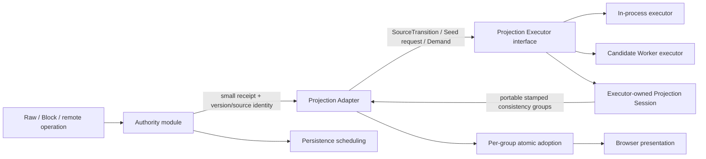

# Loomark concurrent projection execution — implementation plan

**Status:** Active plan; Commits 1–4 are implemented on draft PR #1249. Commit 5 is next.

**Canonical issue:** [#1244 — Loomark: move Markdown projection off the authority commit path](https://github.com/dowdiness/canopy/issues/1244)

**Decision:** [Loomark projection execution is asynchronous and source-stamped](../decisions/2026-08-12-loomark-concurrent-projection-execution.md)

**Conditional integration dependency:** [#1241 — canonical TextEvent admission correctness](https://github.com/dowdiness/canopy/issues/1241). #1244 does not redefine canonical TextEvent admission. If #1241's production contract exists, #1244 consumes it; otherwise #1244 may relocate only the existing accepted authority transition, with characterization evidence preserving current authority semantics.

**Related decisions:**

- [Causal Authority residency](../decisions/2026-08-12-causal-authority-residency.md)
- [Indexed projection lifecycle](../decisions/2026-07-22-indexed-projection-lifecycle.md)
- [Markdown semantic Preview ownership](../decisions/2026-08-04-markdown-semantic-preview-ownership.md)
- [Markdown semantic attachment boundary](../../deps/loom/docs/decisions/2026-08-04-markdown-semantic-attachment-boundary.md)
- [Markdown projection attachment boundary](../../deps/loom/docs/decisions/2026-08-03-markdown-projection-attachment-boundary.md)

## Why

Loomark's current commit path is coherent but shallow. One caller coordinates
causal mutation, parser synchronization, Block reconciliation, semantic Preview
read, persistence preparation, model adoption, and browser presentation. Its
interface nearly describes its implementation, so every new derived view or
parser cost leaks into the authority task.

The desired deep module has one small authority interface: admit one operation
and return settled mutation evidence. Projection execution sits behind a second
seam: submit one immutable committed input and eventually receive zero or more
stamped Artifact Bundles, one per demanded consistency group. This separation
improves locality because authority failures, projection failures, and
presentation failures each have one owner. It improves leverage because
Preview, Block, diagnostics, and later derived artifacts reuse one execution and
currentness contract.

The deletion test justifies both modules. Deleting the authority/projection seam
would move generation, sequencing, stale-result rejection, and demand
coherence back into every edit caller. Deleting the Projection Adapter would
force application update, recovery, and presentation paths to coordinate the
Worker protocol independently. Both deletions disperse rather than concentrate
complexity.

Current evidence does not yet prove the Worker architecture. The existing
`MarkdownSemanticAttachment` owns process-local reactive state, Warren emits one
JavaScript entry, and browser protocol/allocation costs are unknown. This plan
therefore starts with an evidence gate and stops if that gate fails.

## Goals

1. Keep accepted causal mutation, receipt/history evidence, and persistence
   ordering authoritative and independent from later derived work.
2. Remove parser, CST, Block reconciliation, MarkdownIR, diagnostics, and
   Preview materialization from the production main-thread authority task.
3. Keep one long-lived incremental projection session inside the selected
   executor. A browser Worker is a preferred candidate, not an accepted
   production placement before promotion evidence.
4. Give every group work item and artifact explicit generation, order, source,
   and causal provenance.
5. Bound queued projection work while preserving the latest committed source.
6. Adopt each demand-defined consistency group atomically. Visible groups may
   advance independently under stamped currentness rules.
7. Preserve Block edit correctness through exact source and authority fences;
   expose pending state rather than using stale structure.
8. Measure authority, Worker, protocol, adoption, DOM, scheduling, and memory
   costs in a production release build at 2k, 10k, and 50k lines.
9. Leave no production synchronous projection fallback after cutover.

## Non-goals

- Replacing EGW causal history, `TextState`, or the accepted Causal Authority
  residency decision.
- Making persistence, projection, and presentation one transaction.
- Requiring every intermediate committed source to produce an artifact.
- Moving live Loom parsers, `incr` runtimes, scopes, watches, memos, closures, or
  Canopy projection nodes across the Worker seam.
- Shipping a public cache-management or Worker-management interface.
- Guaranteeing cold open, network load, or a 50k-line full projection within one
  16 ms frame.
- Optimizing protocol encoding before its measured cost is isolated.
- Changing CommonMark behavior, Block identity policy, source-map semantics, or
  Preview security policy.

## Existing responsibility map

| Path | Current owner and evidence | Required change |
|---|---|---|
| Raw input | `application.mbt` routes `RawInput`; `raw_selection_transaction.mbt` normalizes it; `document_transaction.mbt` commits it. | Authority commit returns before projection; native input remains responsive while a bundle is pending. |
| ReplaceSource | `ApplicationEvent::RequestCanonicalSource` reaches the same shared commit shell and commits `MarkdownEditRequest::ReplaceSource` through the current editor. | Treat it as one authority mutation, not authority/session replacement. Publish `SourceUnchanged` when the accepted mutation preserves source; otherwise publish a replayable Advance when its source transition is available without adding full-source work to A0/A1.<br>If neither portable result is safely available, invalidate the projection generation and recover from a coherent Seed. |
| Block structural edit | `BlockInput` resolves against current Block/source-map state before `commit_edit_request`. | Resolve only against a stamped immutable Block artifact; apply only under the exact causal-version fence. |
| Undo/redo | `SyncEditor` currently owns `UndoManager`, text authority, parser, and projection in one struct. | Extract authority and projection responsibilities without changing existing public `SyncEditor` behavior during the refactor commit. |
| Remote admission | Production Loomark does not yet have a proven canonical admission route. | Consume #1241's contract if it exists; otherwise relocate only the existing accepted transition without redefining canonical admission. |
| Source-equal causal advance | `commit_classification.mbt` advances document version while retaining source revision. | Reuse the existing payload when valid, but publish or wrap it with the new projection stamp; the old stamped artifact does not become current. Invalidate intent fences bound to the older causal version. |
| Post-commit archive failure | `document_transaction.mbt` classifies the accepted receipt before persistence scheduling/failure. | Preserve the accepted authority event and record persistence failure independently of projection status. |
| Parser failure recovery | `recovery_shell.mbt` and `application.mbt` replace the editor/session after parser failure. | Increment projection generation, dispose the failed session, reject its results, and Seed the replacement. |
| Archive reopen | `editor_session.mbt` reconstructs a fresh editor and semantic attachment from complete local history. | Create authority first, then Seed one new projection generation inside the selected executor from the recovered committed source. |
| Session replacement | `application.mbt` swaps the current `EditorSession` and disposes the old attachment. | Keep one application-lifetime Projection Adapter; replacement changes its generation and executor session. |
| Demand-only change | `preview_read_model.mbt` may read Preview when mode/split demand changes without a commit. | Issue group work for the current source stamp without inventing an authority event. |

Before changing code, refresh every row against the current branch and record
exact file:line evidence in the implementation PR. #1241 may change remote
admission and receipt surfaces.

## Target architecture



### Authority module

The authority module owns causal admission, document version, source identity,
undo/history semantics, small receipt/effect evidence, and persistence
scheduling. Its linearization path does not materialize or copy full source,
export history, prepare archives, encode JSON, transfer executor input, or run
parser/projection work.

Refactor generic `SyncEditor` into composed internal authority and projection
responsibilities while preserving its public facade. Do not duplicate mutation
logic. Before extraction, classify each projection-relevant authority event
exactly once as either a replayable `Advance`/`SourceUnchanged`, or a generation
invalidation followed by coherent `Seed` recovery. Lifecycle replacement events
do not masquerade as `SourceTransition`. If Seed needs full source and no
immutable handle exists, record a `NeedsSeed` control marker in A1, return the
authority result, and materialize the coherent Seed afterward at B.

Trace the authority path as:

- **P0** — command preparation materializes the old source, maps UTF-16 offsets
  to CRDT positions, validates or snaps grapheme boundaries, computes the
  requested text change, and validates authority input;
- **A0** — the authority outcome linearizes as an accepted causal transition,
  no advance, or rejection; an attempted CRDT mutation may occur before this
  classification but is not required for every outcome;
- **A1** — only when A0 accepted a causal transition, before/after causal
  versions, source identity/revision, and either a small accepted effect/evidence
  or `NeedsSeed` control marker complete `CommittedTransition`; and
- **B** — only after A1, deferred replay input or coherent Seed input is
  materialized.

Every authority attempt has one terminal A0 outcome. Rejection or equal
before/after causal versions produce no `CommittedTransition`, A1, or B; their
terminal outcome remains on the authority-event axis. Equal source text with a
changed causal version is an accepted transition: it proceeds through A1 with
`SourceUnchanged`.

P0 may retain only the existing command-input source materialization measured
explicitly. P0, A0, and A1 perform no history export or encoding, archive
preparation, JSON or Worker transfer, parser/projection/semantic work, Preview
work, or DOM work. A0 and A1 add no full-source materialization or copy.

### Projection Adapter

One private application-lifetime module owns generation, projection sequence,
authority document version, source revision, executor acknowledgement, demand,
active work, bounded pending work, adopted consistency groups, failure state,
callback routing, disposal, and trace correlation.

Application edit, recovery, demand, split, and mount paths call this deep module
instead of coordinating parsers or executor callbacks. The pure reducer models
messages and commands as data; executor effects remain in a thin shell.

### Projection Executor interface and placement

Define one normalized protocol before implementing Worker projection semantics.
It has two adapters:

1. **In-process executor** — the first implementation and correctness oracle.
   It establishes Projection Session behavior, reducer laws, portable inputs,
   consistency-group outputs, failures, and normalized comparison.
2. **Worker executor** — a later adapter for the same protocol. It owns Worker
   transport, callback routing, restart, termination, and error conversion.

Each adapter creates and owns a long-lived Projection Session containing its
parser, reactive runtime, Block projection, source maps, identity policy,
semantic attachment, diagnostics, and artifact materializers. Live parser,
scope, watch, memo, closure, or runtime values never cross the executor seam.

Dedicated Worker placement is conditional. It is promoted only after comparison
with the in-process executor proves correctness and records interactive latency,
main-thread isolation, queue pressure, transport cost, failure behavior, and
memory. Production selects one recorded placement; it never silently falls back
at runtime.

### Portable protocol and normalized differential contract

Seed constructs a fresh Projection Session. Advance is legal only when its base
matches the executor's acknowledged source. Demand may request a consistency
group for the current source without an authority event.

Start with explicit typed JSON, without relying on generated JavaScript object
layout. Measure encode, clone, decode, materialization, payload bytes, retained
bytes, and peak live copies. Redesign the wire before production integration if
serialization dominates interactive work or duplicates the document
unacceptably.

Differential comparison includes observable source, Block hierarchy/keys and
ranges, source maps, semantic roles, MarkdownIR, diagnostics, Preview payload,
and selection/resolver evidence. Normalize or exclude Worker-local object and
reactive identities, generation/sequence test values, timestamps, and
incidental map iteration order.

### Projection stamp

A stamp contains generation, adapter-lifetime projection sequence, source
revision, and causal document version:

- generation identifies the Projection Session incarnation;
- projection sequence orders adapter observations and deliveries across
  generations and never resets when generation changes;
- source revision identifies portable source payload changes and cache reuse;
- causal document version validates authority staleness.

Source revision alone never establishes currentness. A source-equal causal
advance may keep source revision unchanged while advancing sequence and causal
version. It may reuse an existing artifact payload, but current adoption
publishes or wraps that payload with the new projection stamp; the old stamped
artifact does not become current. An edit intent fenced to the older causal
version is rejected before authority mutation.

Generation and sequence never wrap or reuse a value within one application
mount. Disposal closes routing before executor termination. Counter exhaustion
and delayed callbacks fail closed. The determinism key is the consistency group,
normalized stamp, and relevant non-authority policy inputs; equality of that key
implies equivalent normalized observable payload.

### Demand-defined consistency groups

Artifact Bundles are immutable, portable, and atomic within one consistency
group, not across every visible lane:

- **Block interactive group** — Block hierarchy, editable kinds, ranges, source
  maps/roles, selection/focus mapping, and BlockIntent resolver evidence;
- **Preview group** — MarkdownIR-derived Preview payload and security decisions;
- **Diagnostics group** — diagnostics for one source provenance.

Diagnostics never delay Block adoption. Hidden Preview is absent. Block-only
mode never waits for Preview. Raw is authority-owned and waits for no projection
group. Split Block+Preview may temporarily show different stamped revisions if
the UI exposes that lag and stale evidence cannot authorize an edit. Requiring
same-source split presentation is a separate measured product trade-off.

### Bounded scheduling and Seed pressure

The scheduler retains one active work item and one pending description, but slot
count is not its memory bound. The pending description also has explicit limits
for Advance count, encoded bytes, and retained source/effect bytes.

A bounded contiguous Advance chain may be retained from the executor's
acknowledged source. When continuity cannot fit, replace it with one latest Seed
request and materialize that Seed outside A0/A1. Replacing unstarted pending work
records `Superseded`; obsolete active output records
`SupersededAfterExecution` and is rejected before artifact decoding where
possible. Authority operations, receipts, history, and persistence are never
coalesced.

Promotion requires all of these structural conditions:

- normal continuous typing does not become one Seed per edit;
- pending payload cannot grow without bound;
- only continuity loss or a configured bound triggers Seed;
- burst work converges to the latest source;
- Seed generation never delays authority commit; and
- superseded Advance/source tails become collectible.

Measure pending Advance count, pending encoded bytes, retained source/effect
bytes, Seed count and bytes per generation/second, Advance-to-Seed ratio,
pre-start supersession rate, and retained tail after catch-up.

### Block interaction and executor failure

Block intent resolves from the latest Block group and carries exact source and
causal-version fences. Between an accepted commit and a current group, the model
exposes typed feedback/pending state; it never applies stale structure. Raw
remains usable unless an explicit authority failure occurs.

Measure separately:

- Block intent to next-paint feedback;
- Block intent to authority commit;
- authority commit to current Block group; and
- interactive intent queue wait.

Preview and diagnostics use separate convergence measures. Values such as 4 ms,
8 ms, 16.7 ms, and 50 ms are provisional browser-trace calibration points, not
ADR invariants.

Executor failure states cover startup failure, decode failure, termination
during active work, timeout/no response, restart with a fresh generation, old
result rejection, and disposal. Authority state survives. Raw either remains
usable or becomes explicitly unavailable; Block/Preview never remain in a fake
permanent pending state.

## P0–F trace contract

Instrumentation is private, opt-in, bounded, and allocation-free when disabled.
One authority event may reference zero or more projection requests. Each request
issues zero or one group work item per demanded consistency group. Authority
event ID, group work ID, and presentation ID are distinct axes; one presentation
may correlate several adopted group work items in the same frame.

| Phase | Linearization point | Required fields |
|---|---|---|
| P0 — command preparation | Authority input is ready for the authority attempt. | event id, operation kind, old-source materialization, UTF-16 mapping, grapheme validation/snapping, requested-change computation, input-validation durations |
| A0 — authority outcome | The attempt linearizes as accepted causal transition, no advance, or rejection. Every authority attempt terminates here. | event id, operation kind, outcome, mutation duration when attempted, classification duration |
| A1 — settled committed-transition evidence | Only an accepted causal transition reaches A1. Before/after causal versions, source identity/revision, and a small accepted effect/evidence or `NeedsSeed` marker complete `CommittedTransition` without full export. | event id, before/after document version, source revision/identity, evidence/control-marker kind and bytes, duration, forbidden-full-export control |
| B — deferred source materialization | Replay input or coherent Seed input is available after A1; no-advance/rejected outcomes never reach B. | event id, projection request id, input kind, bytes/copies, duration |
| C — projection execution | Executor Seed/Advance begins and ends against one acknowledged base. | projection request id, placement, generation, sequence, base/result revision, queue wait, stage durations, request disposition |
| D — artifact publication | One consistency-group envelope is complete. | projection request id, group work id, group, encoded bytes, encode/clone/decode durations, materialized-at |
| E — application adoption | Reducer accepts or rejects one whole group. | group work id, group, stamp, currentness decision, duration, rejection reason, adoption outcome |
| F — presentation | Adopted group work becomes observable or is explicitly retired without presentation. | group work id, group, presentation id when presented, presentation outcome, contiguous main-thread slice, input-to-paint critical path, dropped-frame/Long Task evidence |

`NoDemand` is a projection-request disposition and never creates a group work
id. Materialization at D is progress, not a terminal group outcome. Every issued
group work id eventually receives exactly one final outcome:
`Presented`, `AdoptedNotPresented`, `RejectedAtAdoption`,
`SupersededBeforeExecution`, `SupersededAfterExecution`,
`GenerationInvalidated`, `Failed`, or `Disposed`. `AdoptedNotPresented` requires
an explicit reason such as demand removal or disposal; it is not inferred from a
missing F record. A projection request records its own disposition without
collapsing independent group outcomes. Missing B–F phases require a recorded
reason at the applicable request or group-work axis.

## Test-first execution plan

Use one Canopy issue and implementation PR. Keep characterization, Warren
capability, protocol/reducer, Worker evidence, responsibility refactor,
production integration, and promotion/cleanup in separate commits. A paired
Rabbita PR is permitted only for Warren multi-entry support.

### Commit 1 — characterize responsibility and P0–F behavior

**Files:** existing Loomark reducer/transaction/lifecycle tests, disposable dev
host, and private trace modules.

#### Current responsibility map

This map records the synchronous implementation before instrumentation. `Present`
means Loomark invokes the path today; `façade-only` means Canopy exposes it but
Loomark has no caller; `absent` means no current request or handler exists and
Commit 1 must not invent one.

| Path | Status and authority entry | A0/A1 and post-commit failure | Existing B–F ownership | Current classification |
|---|---|---|---|---|
| Raw `ReplaceText` | Present. `application.mbt:1026-1101` normalizes native input and delegates to `raw_selection_transaction.mbt`; all accepted edits reach `document_transaction.mbt:95-187`. | `MarkdownEditor::commit_recording_transforms` mutates the CRDT; `commit_with_receipt` reads the after-version and exports incremental history at `modules/canopy/editor/markdown/editor.mbt:996-1023`. `document_transaction.mbt:118-185` preserves accepted state across typed export/archive failures. A0 is therefore inside `commit_with_receipt`, before that function returns; current A1 is entangled with incremental history export. | Parser mirror C is synchronous in `sync_editor_parser.mbt:33-64`; Preview D is read at `preview_read_model.mbt:38-59`; Rabbita adopts E in the transaction return; `application.mbt:2236-2285` publishes the model and Rabbita subsequently presents F. | Accepted source change is replayable `Advance`; equal source is `SourceUnchanged`; parser failure enters recovery and coherent Seed reconstruction. |
| `ReplaceSource` | Present. `application.mbt:1151-1236` reduces `RequestCanonicalSource`, then `document_transaction.mbt:192-208` submits one `MarkdownEditRequest::ReplaceSource`. | Same A0/A1 shell as Raw. The façade reuses the exact accepted splice at `editor.mbt:1037-1055`; unsafe post-mutation failure is represented as `MarkdownEditorError::Committed`. | Same synchronous C–F owners as Raw. | `SourceUnchanged` for no-op; replayable `Advance` when the exact accepted splice is portable; Seed barrier only when recovery cannot safely expose that effect outside A0/A1. |
| Block structural edit | Present. Heading/list/delete/text-control events enter at `application.mbt:1276-1546` and delegate through `document_transaction.mbt:213-323`. | Same A0/A1 shell; stale Block evidence is rejected before commit at `application.mbt:1000-1013` and `1402-1417`. | C is the synchronous parser update; Block snapshot plus selection/resolver evidence is D; transaction/model update is E; after-render selection commands and Rabbita paint are F. | Accepted edit is replayable `Advance`; no-op is `SourceUnchanged`; parser failure enters Seed recovery. |
| Undo / redo | Absent from Loomark and absent from `MarkdownEditRequest` (`editor.mbt:343-354`). `SyncEditor` owns an internal undo manager, but no Loomark authority entry exists. | No A0/A1 path to instrument. | No B–F path. | Unclassified until a separately reviewed authority request exists. |
| Remote admission | Façade-only. `MarkdownEditor::admit` delegates to `SyncEditor::admit` at `editor.mbt:880-926`; Loomark has no production caller. | `SyncEditor::admit_with_policy` may partially mutate before reporting failure and synchronizes the parser at `sync_editor.mbt:531-565`. No Loomark receipt/effect boundary exists. | C occurs inside `admit_with_policy`; Loomark has no D–F adoption path. | Not classified by Loomark. Commit 1 characterizes the façade without adding a production route. |
| Source-equal causal advance | Present through any accepted receipt whose document version advances while `document.source()` is equal. `commit_classification.mbt:7-35` is the pure owner. | A0/A1 are the same receipt path. | C updates document version but short-circuits parser source work at `sync_editor_parser.mbt:40-45`; existing Preview is kept by `preview_read_model.mbt:18-25`; E advances `document_version` without `source_revision`. | `SourceUnchanged`; it must not authorize an intent fenced to the old causal version. |
| Demand-only Preview | Present. Mode and split demand enter `application.mbt:1736-1785` without an authority mutation. | No A0/A1 and no `DocumentVersion` advance. | `preview_read_model.mbt:12-59` decides whether to read the retained semantic attachment (current C/D); navigation adopts E; Commit 1 records `AdoptedNotPresented(PresentationNotObservedYet)` after detached publication and does not fabricate browser F. | Demand request, not `Advance` or Seed; `NoDemand` creates no group work. |
| Post-commit history/export failure | Present and typed. `commit_with_receipt` may raise while constructing history at `editor.mbt:1014-1022`; `document_transaction.mbt:118-156` reconstructs accepted state from the current façade frontier. | The mutation is already A0; A1 is emitted after the accepted frontier is known and before history export. Retry is forbidden. | Recovery may reconstruct C/D, adopt E, and explicitly retire without claiming browser presentation. | Preserve the accepted `Advance`/`SourceUnchanged`; failure is not a second authority event. |
| Parser failure recovery | Present. The application shell catches `Failure`/`Committed` and calls `recover_after_parser_failure` at `application.mbt:2494-2507`. | It reads parser-independent source/version/history, never retries the mutation. | `recovery_shell.mbt:75-197` disposes the old attachment, reopens one fresh editor/attachment, swaps the session only after success, adopts the recovered model, and persists it. | Generation invalidation followed by coherent Seed; every old result becomes terminal. |
| Archive reopen | Present at startup through `standalone_bootstrap.mbt`; `editor_session.mbt:25-36` is the recovery reopen helper. | Opening existing history creates a fresh authority/session frontier rather than replaying a new mutation. | A fresh parser, semantic attachment, model, and mounted view establish C–F. | New generation plus Seed from the reopened coherent history. |
| EditorSession replacement | Present only inside recovery. `recovery_shell.mbt:174-180` disposes the old attachment and swaps `session_ref` after the fresh snapshot succeeds. | No new authority mutation; captured accepted source/version/history remain authoritative. | Old C–F state is invalidated; fresh session produces replacement C–F state. | Generation invalidation plus Seed, never `SourceTransition`. |

The first instrumentation seam is therefore not a standalone Projection Adapter.
Commit 1 must distinguish A0 from the history-exporting remainder of
`commit_with_receipt`, observe the existing synchronous C–E owners, explicitly
retire work whose browser presentation is not yet observable, and keep
façade-only or absent paths out of Loomark production dispatch.

Commit 1 intentionally adds two generated typed observation interfaces.
`SyncEditor::observe_projection_during` exposes the direct-dependent
`ProjectionObservationPhase` for A0/C inside one scoped mutation observation.
`MarkdownEditor::commit_with_receipt_observing` maps those phases into its own
direct-dependent `MarkdownProjectionObservationPhase` and adds façade-owned A1
causal evidence. Neither phase enum is transitively constructible, and neither
operation exposes an arm/clear setter. Each scope cleans up on every exit,
coalesces multi-span parser synchronization, and returns whether the CRDT
acceptance seam was consumed. The returned acceptance fact, never lossy trace
storage, controls causal-evidence emission.

**Red tests first:**

1. accepted mutation plus later history/export failure records A0/A1 and never
   authorizes retry;
2. A0/A1 expose only small evidence and invoke no full source/history export,
   archive preparation, JSON generation, or Worker transfer;
3. deferred Seed/source materialization records B after A1;
4. demand-only Preview produces C–E and an explicit not-presented outcome without A0/A1;
5. source-equal causal advance changes causal version without changing source
   revision and invalidates an old intent fence;
6. recovery/session replacement invalidates the generation, gives each old group
   work item a final outcome, and issues coherent Seed recovery;
7. `NoDemand` issues no group work, D materialization is non-terminal, every
   issued group work item has one final outcome, request dispositions do not
   collapse group outcomes, and every missing phase has a reason; and
8. trace-disabled control creates no record or formatted String.

Each later commit calibrates the phases it introduces with a known-positive
event that must emit that phase and a trace-disabled paired run. Commit 2
calibrates Worker capability transport, Commit 3 calibrates B–E in-process,
Commit 4 calibrates Worker C–E and failure omissions, and Commit 6 calibrates F
through browser paint. A clean trace is accepted only after its matching control
fires.

Implement bounded fixed-width tracing around current synchronous behavior
without changing execution. Refresh the responsibility map with exact
file:line evidence, including Raw, ReplaceSource, Block, undo/redo, remote
admission, source-equal advance, post-commit failure, recovery, reopen, session
replacement, and demand-only paths.

**Gate:** current behavior is unchanged; A0/A1 full-export detector is calibrated
with a known-positive control; trace-enabled/disabled paired runs identify
instrumentation overhead.

### Commit 2 — prove Warren multi-entry capability only

**Files:** paired `deps/rabbita/warren/` PR, Loomark page entry, inert private
Worker entry, build scripts, and direct/release assertions.

**Red tests first:**

1. Warren emits exactly one page entry and one named auxiliary Worker entry;
2. direct mode serves both;
3. release output references the Worker asset correctly under static hosting;
4. standalone startup proves page↔Worker request/response and termination; and
5. existing one-entry Warren applications retain output and CLI behavior.

The Worker returns a fixed typed capability response. It does not construct a
parser or define projection payloads. Do not let Warren constraints determine
the projection domain contract.

**Gate 0A:** page and inert Worker entries build and run in direct/release modes.
Record Rabbita commit SHA, Canopy-tested SHA, build matrix, merge order,
partial-merge behavior, and rollback condition. Failure stops Worker work but
does not invalidate the executor seam.

### Commit 3 — define the protocol, pure reducer, and in-process executor

**Files:** private Projection Adapter/reducer modules, normalized portable
protocol, in-process Projection Session/executor, application status types, and
property/differential tests.

**Red reducer tests:**

1. generation invalidates old active, pending, result, and callback paths;
2. adapter-lifetime sequence is monotonic, unique, non-wrapping, and does not
   reset across generation replacement; source revision never acts as the sole
   currentness check;
3. source-equal causal advance keeps source revision, advances sequence/version,
   reuses display payloads only by publishing or wrapping them under the new
   projection stamp, and rejects old Block intent;
4. pending Advance count/bytes/source-effect bytes remain within configured
   bounds under arbitrary message/result interleavings;
5. continuity uses Advance; a gap or exceeded bound issues one latest Seed;
6. Seed capture is a post-A1 command;
7. Block, Preview, and diagnostics consistency groups adopt independently and
   atomically within their group;
8. hidden Preview and diagnostics never block the Block group;
9. each demanded group work item independently ends as presented,
   adopted-not-presented, rejected, superseded, invalidated, failed, or disposed;
10. `NoDemand` creates no group work and materialization is non-terminal;
11. presentation IDs may correlate several adopted group work items; and
12. disposal, timeout, decode failure, and counter-limit cases fail closed.

**Red oracle tests:**

1. Seed and contiguous Advance preserve current main-thread observable behavior;
2. normalized comparison covers source, Block structure/ranges/maps/roles,
   MarkdownIR, diagnostics, Preview, and resolver evidence;
3. runtime identity, timestamps, generation/sequence fixtures, and map ordering
   are normalized rather than compared;
4. equal group, normalized stamp, and relevant non-authority policy inputs imply
   equivalent normalized observable payload; and
5. Block feedback/pending/failure states are typed and non-destructive.

**Gate 0B:** the in-process executor establishes the protocol contract and
passes reducer/property/differential tests before Worker projection semantics
exist.

### Commit 4 — implement real Worker executor and Gate 0C

**Files:** Worker Projection Session entry, typed JSON codec, Worker executor,
standalone/dev-host browser harness, and protocol/queue/heap instrumentation.

The Worker implements the exact Gate 0B protocol. It creates parser, `incr`
runtime, Block projection, source maps, semantic attachment, diagnostics, and
materializers internally. No live runtime value crosses the seam.

**Red tests first:**

1. normalized Worker output equals the in-process executor for the complete
   differential corpus;
2. startup failure, decode failure, active-work termination, timeout/no response,
   and restart produce typed terminal states;
3. restart creates a fresh generation and delayed old output is rejected;
4. authority state survives Worker failure and Raw is usable or explicitly
   unavailable;
5. Block/Preview cannot remain in permanent fake pending state;
6. queue payload limits hold when the Worker is paused for 100–500 ms;
7. Seed processing concurrent with new advances converges to latest source; and
8. superseded sources/Advance tails become collectible after catch-up/cutover.

**Stress scenarios:**

- 10 Hz typing for 30 seconds;
- 30 Hz typing for 5 seconds;
- 10 ms interval short bursts;
- paste equivalent to 100–1000 edits;
- IME composition and composition commit;
- Worker pauses of 100, 250, and 500 ms;
- new advances during Seed; and
- bursts immediately before and after session cutover.

**Metrics and structural rejection conditions:**

- pending Advance count, encoded bytes, retained source/effect bytes;
- Seed count/bytes per generation and second;
- Advance-to-Seed ratio and pre-start supersession rate;
- queue wait and retained tail after catch-up;
- encode/clone/decode/materialization time and peak live copies;
- Worker/in-process Block intent feedback, authority commit, and current-group
  latency p50/p95/p99;
- main-thread contiguous slice, input-to-paint critical path, dropped frames,
  and Long Tasks; and
- startup/restart/cutover heap retention with a positive retention control.

Reject promotion if ordinary typing degenerates to per-edit Seed, pending work
or retained memory is unbounded, Raw authority work scales with document length,
the main thread produces a 50 ms Long Task, Seed capture delays authority
commit, or the Worker cannot recover explicitly. Numerical 4/8/16.7/50 ms
budgets are calibrated from these traces rather than predeclared as invariants.

**Gate 0C:** exact normalized parity, bounded queue/heap, explicit failure
recovery, production-shaped browser operation, and a recorded Worker versus
in-process trade-off. Gate 0C recommends placement; it does not silently promote
the Worker.

### Commit 5 — establish the committed-transition seam, then split ownership

Commit 5 deepens the editor in three ordered stages. It does not begin by moving
fields between two structs. First it makes the accepted authority transition a
value, proves that the existing interaction and projection behavior can consume
that value synchronously, and only then moves ownership. The existing public
`SyncEditor` facade and synchronous production path remain active throughout
this commit.

#### Commit 5A — measure command preparation and establish the semantic seam

**Files:** generic `SyncEditor` mutation/parser internals, Markdown facade and
runtime, focused characterization/property tests, and browser phase probes.

**P0/A0/A1 measurement gate:** attribute command preparation, authority outcome,
and conditionally settled transition evidence separately:

- P0 reports old-source materialization, UTF-16-to-CRDT-position mapping,
  grapheme validation or snapping, requested text-change computation, and
  authority-input validation;
- A0 reports attempted CRDT mutation when present, accepted-transition,
  no-advance, or rejected classification, and authority-outcome linearization;
  and
- A1 exists only for an accepted causal transition and reports before/after
  causal versions, source identity/revision, small accepted effect/evidence or
  `NeedsSeed` control-marker construction, and `CommittedTransition`
  completion.

Reuse existing allocation-free phase probes where they already identify these
costs; measurement must not add per-operation full-source work or allocating
labels/maps. This evidence distinguishes P0 representation/index costs, A0 CRDT
mutation cost, A1 evidence cost, and post-A1 projection cost. Lower-layer
optimization requires the dominant phase to be reproduced in an isolated
microbenchmark. The gate must not reinterpret the current Gate 0C Worker
protocol as a production authority contract.

**Red tests first:**

1. every authority attempt emits exactly one terminal A0 outcome, while only an
   accepted causal advance emits A1 and one committed transition;
2. rejected and equal-version no-advance outcomes emit no A1, B, or
   `CommittedTransition`;
3. a source-equal causal advance is `SourceUnchanged`, retains distinct
   before/after causal versions, and cannot authorize an old intent;
4. `Seed@R` plus a contiguous suffix of replayable Advance and
   `SourceUnchanged` transitions `R→N` is observationally equal to a fresh
   projection at `N`;
5. a `NeedsSeed` transition is never applied as Replay; it captures one coherent
   `Seed@S` after A1, and `Seed@S` plus the contiguous replayable suffix `S→N`
   is observationally equal to a fresh projection at `N`;
6. parser failure preserves the committed transition and fails only its
   projection continuation;
7. remote partial admission does not conflate the accepted transition with
   pending operations or issues;
8. local and peer cursor reconciliation consume the same transition as parser
   synchronization;
9. the legacy synchronous result is observationally equal to interpreting the
   committed transition through the new seam;
10. Raw, exact/structural edit, source replacement, and every currently
    reachable authority path are classified exactly once without forcing
    additional full-source P0/A0/A1 work;
11. recovery, archive reopen, and session replacement invalidate the old
    generation and issue coherent Seed recovery rather than masquerading as a
    source transition;
12. Seed capture occurs after settled authority evidence; and
13. the public `SyncEditor` facade preserves its behavior and generated
    interface.

Introduce one private concrete `CommittedTransition` seam in the existing
package. It contains authority-owned receipt evidence, distinct before/after
causal versions, a typed projection continuation such as replayable Advance,
`SourceUnchanged`, or `NeedsSeed`, and path-native inputs for interaction
reconciliation. Valid inputs include accepted edit/span evidence, cursor
transform input, a source-equal marker, before/after versions, and the
`NeedsSeed` control marker. It does not contain reconciled cursor values, Block
selection, source-map results, parser nodes, projection snapshots, or Seed
full-source payload. `NeedsSeed` completes A1 and triggers coherent source
capture only after A1 at B.

Do not flatten all paths into one universal splice or introduce full-source diff
work to manufacture interaction evidence. Retain each mutation path's natural
effect representation and name any semantic loss explicitly. Transition,
outcome, rejection, and mismatch values must support equality and debug
comparison for the differential oracle.

Produce this transition immediately after accepted mutation and causal-version
capture, before `history_since` or any public receipt/history export. The
compatibility wrapper first interprets the committed transition through the
existing synchronous interaction/projection path, then attaches deferred
incremental history evidence. The transition itself contains no projection
snapshot or view selection. Reuse accepted path-native `MarkdownTextTransform`
or lower-layer operation evidence where available; never reconstruct the
transition from before/after full source.

Implement 5A in this order: authority-outcome and conditional-A1 red tests;
replayable-suffix and `NeedsSeed` barrier-recovery properties; private
`CommittedTransition` with custom constructors and typed rejection; legacy
synchronous interpreter; parser-failure isolation; cursor/peer reconciliation
parity; P0/A0/A1 measurement; then full-facade parity. Transition, outcome, and
mismatch values derive equality and debug comparison.

Consume #1241's canonical event representation if its production contract
exists when this stage starts. Otherwise relocate only the existing accepted
authority transition, preserve current semantics with characterization
evidence, and do not redefine #1241's admission contract. Lower-layer CRDT
public interface work is explicitly conditional on the P0/A0/A1 measurements.
If a lower-layer stage dominates and an isolated microbenchmark reproduces it,
open a separate event-graph-walker issue to investigate the specific source
representation, position-index, mutation, or accepted-effect contract involved.
Do not add a generic public delta, persistent snapshot root, or immutable
snapshot handle without that evidence.

#### Commit 5B — extract responsibility owners behind the proven seam

**Files:** generic `SyncEditor` internals, Markdown runtime, focused ownership
tests, and generated interfaces.

After 5A parity is green, move fields and behavior into three private owners:

- `AuthorityCore` owns `TextState`, undo/history, sync admission, and receipt
  construction;
- `ProjectionState[T]` owns parser synchronization, the reactive causal-version
  mirror, projection memos, source maps, capabilities, parser failure, and
  pending identity hints; and
- `InteractionState` owns the local cursor, peer cursors, ephemeral hub,
  WebSocket/session state, and transition-driven cursor reconciliation.

Before moving a field, check in an exhaustive ownership ledger for every current
`SyncEditor` field and public method. For each method, record its primary owner,
read dependencies, mutation owner, orchestration order, failure owner, and
permitted cross-owner calls. At minimum, mutation, history, causal snapshot,
undo/redo, and sync admission delegate to `AuthorityCore`; parser health/runtime,
projection reads, registry/source-map/capability reads, and identity hints
delegate to `ProjectionState[T]`; cursor, presence, peer, ephemeral subscription,
WebSocket, and sync-session operations delegate to `InteractionState`.
Cross-owner public methods remain on the shell and name the single orchestration
order they preserve. The ledger is a refactor checklist, not a new public
interface; every entry must be accounted for before 5B closes.

The shell `SyncEditor[T]` retains its existing public facade and delegates to
those owners. `ProjectionState[T]` may depend on the parser and reactive runtime;
`AuthorityCore` must not. `InteractionState` is a first-class owner rather than
being hidden inside either authority or projection. Treat `TextState::version()`
as authority truth and the reactive document-version input as a projection
mirror. Field movement and transition-semantics changes must not share a patch.
Inspect generated `.mbti` output after each ownership move; no public interface
drift is intended.

#### Commit 5C — add the private projection-free construction seam

**Files:** extracted editor owners, private constructors, comparison wiring, and
focused tests.

Only after the physical split is complete, add a private construction path that
creates `AuthorityCore` plus `InteractionState` without constructing a parser,
reactive runtime, or projection memo. Projection-free construction must not
implicitly start WebSocket, sync-session, subscription, or other external
interaction effects; construction and activation remain separate wherever
those effects exist. Construct and activate `ProjectionState[T]` only in the
selected executor. Capture Seed after authority evidence, preserve the existing
synchronous interpreter as the differential oracle, and expose the seam only to
the private comparison flag used by Commit 6. Do not make the owners generic
framework modules until a second real adapter justifies the seam.

**Commit 5 gate:** P0/A0/A1 costs are separately attributable; transition
parity, interaction reconciliation, failure isolation, and replay convergence
are green; the projection-free construction path performs no
parser/reactive/projection setup or external interaction activation; the
existing synchronous facade remains behaviorally and publicly unchanged.

### Commit 6 — integrate the application-lifetime Adapter behind a comparison flag

**Files:** Projection Adapter shell, chosen executor placement, Loomark
application/transaction/demand/lifecycle paths, consistency-group views, and
browser tests.

**Red tests first:**

1. authority receipt and Raw feedback precede any projection result;
2. Block feedback reaches the next paint target independently from convergence;
3. Block group never waits for Preview or diagnostics;
4. split-view group stamps expose temporary lag honestly;
5. stale source/version, old generation, delayed callback, and disposed results
   never authorize an edit or reach presentation;
6. recovery/reopen/replacement/failure starts a fresh generation;
7. executor failure preserves authority and exits pending explicitly; and
8. feature-gated in-process and Worker runs preserve normalized behavior.

Replace direct attachment reads with adapter demand only behind a private
comparison flag. Move semantic attachment ownership into the chosen executor
session. Retain the old synchronous path for comparative browser evidence; do
not expose runtime fallback.

### Commit 7 — promotion decision, production cutover, and cleanup

Run 2k/10k/50k release-browser scenarios for cold Seed, local edits at
start/middle/end, sustained typing, back-to-back Block intent, demand-only
Preview, split edit, source-equal advance, failure/restart, cutover bursts, and
100 cutovers with forced GC.

Report separately:

- Raw input→visual echo and authority commit;
- Block intent→feedback, intent→authority commit, authority commit→current Block;
- latest authority event→current Preview/diagnostics;
- maximum contiguous main-thread slice and cumulative input→paint critical path;
- queue wait, dropped frames, Long Tasks;
- stage/transport durations, payload/copy counts; and
- retained executor/parser/source/artifact memory.

Compare in-process, Worker, and current synchronous baselines with
counterbalanced run order. The promotion record chooses production placement
and states whether it prioritizes absolute Block latency or main-thread
isolation. A dedicated Worker is not approved merely because it functions.

If neither single placement passes every gate, and the evidence specifically
shows that in-process execution gives acceptable interactive Block latency while
causing Preview/diagnostics main-thread Long Tasks, whereas Worker execution
isolates those Long Tasks but misses the Block round-trip target, run one
conditional hybrid spike. Keep interactive Block parsing, resolution, and
reconciliation in process; place Preview, MarkdownIR, diagnostics, and cold
rebuild in the Worker. The split is valid only when it follows the existing
consistency-group seam and the hybrid passes the same normalized/currentness
contract. Do not implement the hybrid before both single placements fail. A
production hybrid selection changes the accepted placement decision and
therefore requires an ADR update before cutover.

Only after promotion gates pass:

1. remove the private comparison flag and unchosen production placement;
2. delete direct semantic-attachment reads, synchronous projection fields and
   callbacks, shadow production hooks, and compatibility routes;
3. keep normalized differential and reducer/property tests;
4. update Loomark build/development and performance evidence; and
5. update this plan, the ADR, #1244, and the prior Preview ownership ADR.

## Validation commands

Run from the Canopy repository root unless a command names a submodule:

```bash
rtk moon check
rtk moon test apps/loomark/internal/rabbita
rtk moon test modules/canopy/editor
rtk moon test modules/canopy/editor/markdown
rtk moon test
rtk moon fmt --check
rtk ./scripts/test-loomark-dev-host-e2e.sh
rtk ./scripts/test-loomark-standalone-e2e.sh
rtk ./scripts/check-documentation-lifecycle.sh
rtk ./scripts/check-agent-doc-links.sh
```

Run the paired Warren package tests in `deps/rabbita` before advancing its
gitlink. Use `moon ide` diagnostics during every MoonBit edit. Inspect generated
`.mbti` diffs after each Canopy interface change. The commit that introduces the
release browser benchmark harness must add its exact release invocation and raw
output location to this section. Run that benchmark separately and retain its
raw output as evidence rather than making machine-specific latency thresholds CI
assertions.

## Acceptance criteria

### Authority and correctness

- [ ] #1244 does not redefine canonical TextEvent admission. It consumes #1241's
      production contract when available; otherwise it relocates only the
      existing accepted authority transition and proves unchanged semantics with
      characterization evidence.
- [ ] Every accepted operation retains exact causal receipt/history evidence
      even when projection, persistence, or presentation later fails.
- [ ] P0 may retain only the existing command-input source materialization, and
      that cost is measured explicitly.
- [ ] P0, A0, and A1 perform no history export/encoding, archive preparation,
      JSON/Worker transfer, parser/projection/semantic work, Preview work, or DOM
      work. A0 and A1 add no full-source materialization or copy.
- [ ] P0 separately attributes old-source materialization, UTF-16 mapping,
      grapheme validation/snapping, requested text-change computation, and
      authority-input validation.
- [ ] Every authority attempt has exactly one terminal A0 outcome: accepted
      causal transition, no advance, or rejection. A0 separately attributes
      attempted CRDT mutation when present, classification, and linearization.
- [ ] Only an accepted causal transition reaches A1 and creates
      `CommittedTransition`; rejection and equal-version no-advance produce no
      A1 or B. Source-equal text with changed causal version reaches A1 as
      `SourceUnchanged`.
- [ ] A1 separately attributes before/after causal versions, source
      identity/revision, small accepted effect/evidence or `NeedsSeed`
      control-marker construction, and `CommittedTransition` completion.
- [ ] One private committed-transition value is the sole semantic seam consumed
      by interaction reconciliation and projection continuation; authority
      mutation is not repeated or reconstructed downstream.
- [ ] `AuthorityCore`, `InteractionState`, and `ProjectionState[T]` have distinct
      ownership, and projection-free construction creates no parser, reactive
      runtime, projection memo, semantic attachment, or source map and activates
      no external interaction effect.
- [ ] Every projection-relevant authority event is classified exactly once as
      replayable Advance/SourceUnchanged or generation invalidation followed by
      coherent Seed recovery. ReplaceSource uses Seed only when its accepted
      replay effect is unavailable without unsafe or full-source A0/A1 work;
      lifecycle replacement does not masquerade as SourceTransition.
- [ ] A source-equal advance may reuse an artifact payload, but current adoption
      publishes or wraps it with the new projection stamp; the old stamped
      artifact never becomes current.
- [ ] Existing `SyncEditor` callers retain behavior and public interface unless
      an explicitly reviewed interface change is recorded.

### Executor and projection

- [ ] Warren direct and release builds emit and serve one page entry and one
      inert Worker entry before projection semantics are added.
- [ ] The normalized protocol and in-process executor pass before the Worker
      implements projection semantics.
- [ ] Each executor creates and retains its parser, `incr` runtime, semantic
      attachment, projection memos, and collection state inside its own
      Projection Session.
- [ ] Normalized differential replayable Advance/SourceUnchanged suffixes have
      zero observable differences across the complete corpus.
- [ ] `Seed@R` plus a contiguous replayable Advance/SourceUnchanged suffix
      `R→N` is observationally equal to a fresh projection at `N`.
- [ ] Every `NeedsSeed` barrier is excluded from Replay, captures a coherent
      `Seed@S` after A1, and satisfies `Seed@S` plus contiguous replayable suffix
      `S→N` equals a fresh projection at `N`.
- [ ] Production selects only the placement approved by the promotion record and
      never silently changes placement at runtime.
- [ ] Pending slot, Advance count, encoded bytes, and retained source/effect
      bytes remain bounded.
- [ ] Normal continuous typing does not degenerate to per-edit Seed; a
      continuity gap or configured bound produces one latest Seed.

### Currentness and lifecycle

- [ ] Generation, adapter-lifetime sequence, source revision, and causal document
      version retain their distinct meanings on every projection request and
      consistency-group artifact.
- [ ] Sequence never resets across generation replacement, wraps, or reuses a
      value within one application mount.
- [ ] No currentness check relies on source revision alone.
- [ ] Stale generation, sequence, source, causal version, disposed callback, and
      counter-wrap cases all fail closed.
- [ ] `NoDemand` is request disposition and creates no group work;
      materialization is non-terminal; every issued group work id has exactly one
      final outcome distinguishing presented, adopted-not-presented, rejected,
      superseded, invalidated, failed, and disposed work.
- [ ] Block, Preview, and diagnostics adopt independently and atomically within
      their own consistency group; Preview/diagnostics never delay Block.
- [ ] Equal group, normalized stamp, and relevant non-authority policy inputs
      imply equivalent normalized observable payload.
- [ ] Source-equal causal advance may reuse artifact payloads under a new
      projection stamp but cannot apply an intent fenced to the older causal
      version.
- [ ] Recovery, archive reopen, session replacement, executor failure, and
      remount dispose old projection state and reject every late result.

### Product behavior

- [ ] Raw native input remains usable while projection work is blocked.
- [ ] Block mode exposes a typed, non-destructive pending state and never applies
      stale structural intent.
- [ ] Block identity, selection, focus, source maps, diagnostics, Preview output,
      recovery rendering, escaping, and dangerous-URL rejection preserve their
      existing observable contracts.
- [ ] Demand-only Preview/split changes materialize the current source without
      inventing an authority event.
- [ ] Existing archive/persistence ordering remains independent of artifact
      arrival.

### Performance and memory evidence

- [ ] P0–F trace has calibrated known-positive and trace-disabled controls.
- [ ] 2k/10k/50k release-browser scenarios record raw paired data and all named
      phase, queue, payload/copy, and consistency-group metrics.
- [ ] Reports include maximum contiguous main-thread slice, cumulative
      input-to-paint critical path, dropped frames, Long Tasks, and separate
      Block feedback/authority/current-group latency.
- [ ] Continuous and burst typing retain bounded work/memory, avoid per-edit
      Seed, and catch up to latest source after Worker pauses and cutovers.
- [ ] Forced-GC cutover tests, calibrated with a positive retention control,
      show no old executor/session/parser/source/artifact reachable from the
      current adapter.
- [ ] No speedup, locality, allocation, or memory claim relies only on a Moon
      microbenchmark or an uncalibrated clean browser result.
- [ ] A hybrid placement is considered only after both single placements fail
      complementary gates; any production hybrid has an updated ADR and passes
      the same differential, currentness, lifecycle, and browser evidence.

### Cleanup and documentation

- [ ] Direct application semantic-attachment reads and obsolete synchronous
      projection fields/callbacks are removed.
- [ ] Shadow production hooks and compatibility routes are removed; the
      differential oracle corpus remains as test evidence.
- [ ] Generated interfaces contain only the intended public changes.
- [ ] Loomark build/development documentation names the selected production
      placement and any page/Worker assets it requires.
- [ ] Performance history links raw evidence, environment, compared placements,
      promotion rationale, and commit SHAs.
- [ ] This plan's status and the ADR status are updated only after every checked
      criterion has concrete evidence.

## Risks and stop conditions

1. **Worker cannot host the current reactive parser or loses the measured
   placement comparison.** Stop Worker promotion; retain the executor seam and
   evaluate the in-process placement explicitly rather than emulating
   concurrency or adding runtime fallback.
2. **Warren multi-entry support requires a generic interface that harms other
   apps.** Re-run the deletion test and design the build seam twice before
   changing Warren's public CLI.
3. **Seed storms erase incrementality.** Stop production cutover if the bounded
   queue cannot catch up after the typing burst or if Seed/Advance evidence shows
   no steady-state reuse.
4. **Portable artifacts duplicate the whole document several times.** Measure
   payload ownership and redesign the artifact before application integration;
   do not hide copies behind helper modules.
5. **Block pending behavior breaks editing expectations.** The pending contract
   is part of Gate 0 browser validation. Do not weaken source/version fences to
   make the UI appear responsive.
6. **Authority still materializes full source or history in A0/A1.** Stop and
   move materialization behind B; naming the cost "source publication" does not
   satisfy the invariant.
7. **DOM reconciliation remains the dominant long task.** Record the result and
   address the presentation module in the same issue when it violates the
   calibrated promotion gate; do not claim success from Worker isolation alone.
8. **A case falls outside the state machine.** Stop implementation and amend the
   decision/plan before adding an ad-hoc branch.

## Completion record

When implementation completes:

1. mark this plan `Status: Complete` only after every applicable acceptance box
   is checked with evidence;
2. add the implementation PR, paired Warren PR, final SHAs, benchmark artifact,
   and CI links here;
3. update the ADR from "implementation is not complete" to `Accepted` and record
   any measured qualification;
4. move this plan to `docs/archive/` only if active guidance no longer needs it;
5. update `docs/README.md` for any move; and
6. close #1244 with the exact evidence links.
