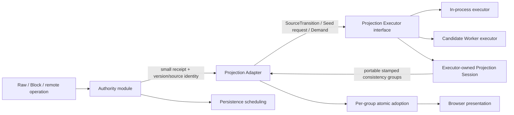

# Loomark concurrent projection execution — implementation plan

**Status:** Active plan; no implementation has landed.

**Canonical issue:** [#1244 — Loomark: move Markdown projection off the authority commit path](https://github.com/dowdiness/canopy/issues/1244)

**Decision:** [Loomark projection execution is asynchronous and source-stamped](../decisions/2026-08-12-loomark-concurrent-projection-execution.md)

**Required predecessor:** [#1241 — canonical TextEvent admission correctness](https://github.com/dowdiness/canopy/issues/1241). Gate A must prove the canonical event model before this plan changes a production authority path.

**Related decisions:**

- [Causal Authority residency](../decisions/2026-08-12-causal-authority-residency.md)
- [Indexed projection lifecycle](../decisions/2026-07-22-indexed-projection-lifecycle.md)
- [Markdown semantic Preview ownership](../decisions/2026-08-04-markdown-semantic-preview-ownership.md)
- [Markdown semantic attachment boundary](../../deps/loom/docs/decisions/2026-08-04-markdown-semantic-attachment-boundary.md)
- [Markdown projection attachment boundary](../../deps/loom/docs/decisions/2026-08-03-markdown-projection-attachment-boundary.md)

## Why

Loomark's current commit path is coherent but shallow. One caller coordinates
causal mutation, parser synchronization, Block reconciliation, semantic Preview
read, persistence preparation, model adoption, and browser presentation. Its
interface nearly describes its implementation, so every new derived view or
parser cost leaks into the authority task.

The desired deep module has one small authority interface: admit one operation
and return settled mutation evidence. Projection execution sits behind a second
seam: submit one immutable committed input and eventually receive one stamped
Artifact Bundle. This separation improves locality because authority failures,
projection failures, and presentation failures each have one owner. It improves
leverage because Preview, Block, diagnostics, and later derived artifacts reuse
one execution and currentness contract.

The deletion test justifies both modules. Deleting the authority/projection seam
would move generation, sequencing, stale-result rejection, and demand
coherence back into every edit caller. Deleting the Projection Adapter would
force application update, recovery, and presentation paths to coordinate the
Worker protocol independently. Both deletions disperse rather than concentrate
complexity.

Current evidence does not yet prove the Worker architecture. The existing
`MarkdownSemanticAttachment` owns process-local reactive state, Warren emits one
JavaScript entry, and browser protocol/allocation costs are unknown. This plan
therefore starts with an evidence gate and stops if that gate fails.

## Goals

1. Keep accepted causal mutation, receipt/history evidence, and persistence
   ordering authoritative and independent from later derived work.
2. Remove parser, CST, Block reconciliation, MarkdownIR, diagnostics, and
   Preview materialization from the production main-thread authority task.
3. Keep one long-lived incremental projection session inside a browser Worker.
4. Give every work item and artifact explicit generation, order, source, and
   causal provenance.
5. Bound queued projection work while preserving the latest committed source.
6. Adopt every simultaneously visible projection lane atomically.
7. Preserve Block edit correctness through exact source and authority fences;
   expose pending state rather than using stale structure.
8. Measure authority, Worker, protocol, adoption, DOM, scheduling, and memory
   costs in a production release build at 2k, 10k, and 50k lines.
9. Leave no production synchronous projection fallback after cutover.

## Non-goals

- Replacing EGW causal history, `TextState`, or the accepted Causal Authority
  residency decision.
- Making persistence, projection, and presentation one transaction.
- Requiring every intermediate committed source to produce an artifact.
- Moving live Loom parsers, `incr` runtimes, scopes, watches, memos, closures, or
  Canopy projection nodes across the Worker seam.
- Shipping a public cache-management or Worker-management interface.
- Guaranteeing cold open, network load, or a 50k-line full projection within one
  16 ms frame.
- Optimizing protocol encoding before its measured cost is isolated.
- Changing CommonMark behavior, Block identity policy, source-map semantics, or
  Preview security policy.

## Existing responsibility map

| Path | Current owner and evidence | Required change |
|---|---|---|
| Raw input | `application.mbt` routes `RawInput`; `raw_selection_transaction.mbt` normalizes it; `document_transaction.mbt` commits it. | Authority commit returns before projection; native input remains responsive while a bundle is pending. |
| ReplaceSource | `ApplicationEvent::RequestCanonicalSource` reaches the same shared commit shell. | Treat as an authority replacement followed by a new projection generation Seed. |
| Block structural edit | `BlockInput` resolves against current Block/source-map state before `commit_edit_request`. | Resolve only against a stamped immutable Block artifact; apply only under the exact causal-version fence. |
| Undo/redo | `SyncEditor` currently owns `UndoManager`, text authority, parser, and projection in one struct. | Extract authority and projection responsibilities without changing existing public `SyncEditor` behavior during the refactor commit. |
| Remote admission | Production Loomark does not yet have a proven canonical admission route. | Do not cut over until #1241 lands; route its accepted operation through the same authority-event publication seam. |
| Source-equal causal advance | `commit_classification.mbt` advances document version while retaining source revision. | Carry the current artifact by source revision, but invalidate intent fences bound to the older causal version. |
| Post-commit archive failure | `document_transaction.mbt` classifies the accepted receipt before persistence scheduling/failure. | Preserve the accepted authority event and record persistence failure independently of projection status. |
| Parser failure recovery | `recovery_shell.mbt` and `application.mbt` replace the editor/session after parser failure. | Increment projection generation, dispose the failed session, reject its results, and Seed the replacement. |
| Archive reopen | `editor_session.mbt` reconstructs a fresh editor and semantic attachment from complete local history. | Create authority first, then Seed one new Worker projection generation from the recovered committed source. |
| Session replacement | `application.mbt` swaps the current `EditorSession` and disposes the old attachment. | Keep one application-lifetime Projection Adapter; replacement changes its generation and executor session. |
| Demand-only change | `preview_read_model.mbt` may read Preview when mode/split demand changes without a commit. | Request an Artifact Bundle for the current source stamp without inventing an authority event. |

Before changing code, refresh every row against the current branch and record
exact file:line evidence in the implementation PR. #1241 may change remote
admission and receipt surfaces.

## Target architecture



### Authority module

The authority module owns causal admission, document version, source identity,
undo/history semantics, small receipt/effect evidence, and persistence
scheduling. Its linearization path does not materialize or copy full source,
export history, prepare archives, encode JSON, transfer executor input, or run
parser/projection work.

Refactor generic `SyncEditor` into composed internal authority and projection
responsibilities while preserving its public facade. Do not duplicate mutation
logic. Before extraction, characterize every text-changing path and prove that
the authority side can publish a small accepted SourceTransition. If Seed needs
full source and no immutable handle exists, record `SeedCaptureRequired`, return
the authority result, and materialize source afterward.

Trace the authority boundary as:

- **A0** — causal mutation is irreversibly classified;
- **A1** — small receipt/effect, document version, and source identity are
  available; and
- **B** — deferred SourceTransition or Seed input is materialized.

Property tests and trace fields must make it structurally impossible for A0/A1
to perform full-source export, history encoding, archive preparation, JSON
generation, or Worker transfer.

### Projection Adapter

One private application-lifetime module owns generation, projection sequence,
authority document version, source revision, executor acknowledgement, demand,
active work, bounded pending work, adopted consistency groups, failure state,
callback routing, disposal, and trace correlation.

Application edit, recovery, demand, split, and mount paths call this deep module
instead of coordinating parsers or executor callbacks. The pure reducer models
messages and commands as data; executor effects remain in a thin shell.

### Projection Executor interface and placement

Define one normalized protocol before implementing Worker projection semantics.
It has two adapters:

1. **In-process executor** — the first implementation and correctness oracle.
   It establishes Projection Session behavior, reducer laws, portable inputs,
   consistency-group outputs, failures, and normalized comparison.
2. **Worker executor** — a later adapter for the same protocol. It owns Worker
   transport, callback routing, restart, termination, and error conversion.

Each adapter creates and owns a long-lived Projection Session containing its
parser, reactive runtime, Block projection, source maps, identity policy,
semantic attachment, diagnostics, and artifact materializers. Live parser,
scope, watch, memo, closure, or runtime values never cross the executor seam.

Dedicated Worker placement is conditional. It is promoted only after comparison
with the in-process executor proves correctness and records interactive latency,
main-thread isolation, queue pressure, transport cost, failure behavior, and
memory. Production selects one recorded placement; it never silently falls back
at runtime.

### Portable protocol and normalized differential contract

Seed constructs a fresh Projection Session. Advance is legal only when its base
matches the executor's acknowledged source. Demand may request a consistency
group for the current source without an authority event.

Start with explicit typed JSON, without relying on generated JavaScript object
layout. Measure encode, clone, decode, materialization, payload bytes, retained
bytes, and peak live copies. Redesign the wire before production integration if
serialization dominates interactive work or duplicates the document
unacceptably.

Differential comparison includes observable source, Block hierarchy/keys and
ranges, source maps, semantic roles, MarkdownIR, diagnostics, Preview payload,
and selection/resolver evidence. Normalize or exclude Worker-local object and
reactive identities, generation/sequence test values, timestamps, and
incidental map iteration order.

### Projection stamp

A stamp contains generation, projection sequence, source revision, and causal
document version:

- generation identifies the Projection Session incarnation;
- projection sequence orders adapter observation and delivery;
- source revision identifies portable source payload changes and cache reuse;
- causal document version validates authority staleness.

Source revision alone never establishes currentness. A source-equal causal
advance may keep source revision unchanged while advancing sequence and causal
version. Display artifacts may be carried forward, but an edit intent fenced to
the older causal version is rejected before authority mutation.

Generation and sequence never wrap or reuse a value within one application
mount. Disposal closes routing before executor termination. Counter exhaustion
and delayed callbacks fail closed. Equal normalized stamps identify equal
observable payloads.

### Demand-defined consistency groups

Artifact Bundles are immutable, portable, and atomic within one consistency
group, not across every visible lane:

- **Block interactive group** — Block hierarchy, editable kinds, ranges, source
  maps/roles, selection/focus mapping, and BlockIntent resolver evidence;
- **Preview group** — MarkdownIR-derived Preview payload and security decisions;
- **Diagnostics group** — diagnostics for one source provenance.

Diagnostics never delay Block adoption. Hidden Preview is absent. Block-only
mode never waits for Preview. Raw is authority-owned and waits for no projection
group. Split Block+Preview may temporarily show different stamped revisions if
the UI exposes that lag and stale evidence cannot authorize an edit. Requiring
same-source split presentation is a separate measured product trade-off.

### Bounded scheduling and Seed pressure

The scheduler retains one active work item and one pending description, but slot
count is not its memory bound. The pending description also has explicit limits
for Advance count, encoded bytes, and retained source/effect bytes.

A bounded contiguous Advance chain may be retained from the executor's
acknowledged source. When continuity cannot fit, replace it with one latest Seed
request and materialize that Seed outside A0/A1. Replacing unstarted pending work
records `Superseded`; obsolete active output records
`SupersededAfterExecution` and is rejected before artifact decoding where
possible. Authority operations, receipts, history, and persistence are never
coalesced.

Promotion requires all of these structural conditions:

- normal continuous typing does not become one Seed per edit;
- pending payload cannot grow without bound;
- only continuity loss or a configured bound triggers Seed;
- burst work converges to the latest source;
- Seed generation never delays authority commit; and
- superseded Advance/source tails become collectible.

Measure pending Advance count, pending encoded bytes, retained source/effect
bytes, Seed count and bytes per generation/second, Advance-to-Seed ratio,
pre-start supersession rate, and retained tail after catch-up.

### Block interaction and executor failure

Block intent resolves from the latest Block group and carries exact source and
causal-version fences. Between an accepted commit and a current group, the model
exposes typed feedback/pending state; it never applies stale structure. Raw
remains usable unless an explicit authority failure occurs.

Measure separately:

- Block intent to next-paint feedback;
- Block intent to authority commit;
- authority commit to current Block group; and
- interactive intent queue wait.

Preview and diagnostics use separate convergence measures. Values such as 4 ms,
8 ms, 16.7 ms, and 50 ms are provisional browser-trace calibration points, not
ADR invariants.

Executor failure states cover startup failure, decode failure, termination
during active work, timeout/no response, restart with a fresh generation, old
result rejection, and disposal. Authority state survives. Raw either remains
usable or becomes explicitly unavailable; Block/Preview never remain in a fake
permanent pending state.

## A–F trace contract

Instrumentation is private, opt-in, bounded, and allocation-free when disabled.
One authority event may reference zero or more artifact work items; one work item
may produce several consistency-group artifacts.

| Phase | Linearization point | Required fields |
|---|---|---|
| A0 — authority mutation | Commit is irreversibly classified. | event id, operation kind, accepted/rejected, before/after document version, duration |
| A1 — authority evidence | Small receipt/effect and source identity are available without full export. | event id, source revision/identity, evidence bytes, duration, forbidden-full-export control |
| B — deferred source materialization | SourceTransition or Seed input is available after A1. | event id, work id, input kind, bytes/copies, duration |
| C — projection execution | Executor Seed/Advance begins and ends against one acknowledged base. | work id, placement, generation, sequence, base/result revision, queue wait, stage durations, terminal status |
| D — artifact publication | One consistency-group envelope is complete. | work id, group, encoded bytes, encode/clone/decode durations, terminal status |
| E — application adoption | Reducer accepts or rejects one whole group. | work id, group, stamp, currentness decision, duration, rejection reason |
| F — presentation | Adopted work becomes observable after reconciliation/paint. | work id, group, presentation id, contiguous main-thread slice, input-to-paint critical path, dropped-frame/Long Task evidence |

Every issued work id receives exactly one terminal status:
`Materialized`, `Superseded`, `SupersededAfterExecution`,
`GenerationInvalidated`, `RejectedAtAdoption`, `Failed`, or `Disposed`.
Missing B–F phases require a recorded reason.
## Test-first execution plan

Use one Canopy issue and implementation PR. Keep characterization, Warren
capability, protocol/reducer, Worker evidence, responsibility refactor,
production integration, and promotion/cleanup in separate commits. A paired
Rabbita PR is permitted only for Warren multi-entry support.

### Commit 1 — characterize responsibility and A0–F behavior

**Files:** existing Loomark reducer/transaction/lifecycle tests, disposable dev
host, and private trace modules.

**Red tests first:**

1. accepted mutation plus later history/export failure records A0/A1 and never
   authorizes retry;
2. A0/A1 expose only small evidence and invoke no full source/history export,
   archive preparation, JSON generation, or Worker transfer;
3. deferred Seed/source materialization records B after A1;
4. demand-only Preview produces C–F without A0/A1;
5. source-equal causal advance changes causal version without changing source
   revision and invalidates an old intent fence;
6. recovery/session replacement gives old work a terminal invalidation;
7. every work has one terminal status and every missing phase has a reason; and
8. trace-disabled control creates no record or formatted String.

Each later commit calibrates the phases it introduces with a known-positive
event that must emit that phase and a trace-disabled paired run. Commit 2
calibrates Worker capability transport, Commit 3 calibrates B–E in-process,
Commit 4 calibrates Worker C–E and failure omissions, and Commit 6 calibrates F
through browser paint. A clean trace is accepted only after its matching control
fires.

Implement bounded fixed-width tracing around current synchronous behavior
without changing execution. Refresh the responsibility map with exact
file:line evidence, including Raw, ReplaceSource, Block, undo/redo, remote
admission, source-equal advance, post-commit failure, recovery, reopen, session
replacement, and demand-only paths.

**Gate:** current behavior is unchanged; A0/A1 full-export detector is calibrated
with a known-positive control; trace-enabled/disabled paired runs identify
instrumentation overhead.

### Commit 2 — prove Warren multi-entry capability only

**Files:** paired `deps/rabbita/warren/` PR, Loomark page entry, inert private
Worker entry, build scripts, and direct/release assertions.

**Red tests first:**

1. Warren emits exactly one page entry and one named auxiliary Worker entry;
2. direct mode serves both;
3. release output references the Worker asset correctly under static hosting;
4. standalone startup proves page↔Worker request/response and termination; and
5. existing one-entry Warren applications retain output and CLI behavior.

The Worker returns a fixed typed capability response. It does not construct a
parser or define projection payloads. Do not let Warren constraints determine
the projection domain contract.

**Gate 0A:** page and inert Worker entries build and run in direct/release modes.
Record Rabbita commit SHA, Canopy-tested SHA, build matrix, merge order,
partial-merge behavior, and rollback condition. Failure stops Worker work but
does not invalidate the executor seam.

### Commit 3 — define the protocol, pure reducer, and in-process executor

**Files:** private Projection Adapter/reducer modules, normalized portable
protocol, in-process Projection Session/executor, application status types, and
property/differential tests.

**Red reducer tests:**

1. generation invalidates old active, pending, result, and callback paths;
2. sequence is monotonic, unique, non-wrapping, and source revision never acts
   as the sole currentness check;
3. source-equal causal advance keeps source revision, advances sequence/version,
   carries display artifacts, and rejects old Block intent;
4. pending Advance count/bytes/source-effect bytes remain within configured
   bounds under arbitrary message/result interleavings;
5. continuity uses Advance; a gap or exceeded bound issues one latest Seed;
6. Seed capture is a post-A1 command;
7. Block, Preview, and diagnostics consistency groups adopt independently and
   atomically within their group;
8. hidden Preview and diagnostics never block the Block group;
9. every work and group receives one terminal result;
10. disposal, timeout, decode failure, and counter-limit cases fail closed.

**Red oracle tests:**

1. Seed and contiguous Advance preserve current main-thread observable behavior;
2. normalized comparison covers source, Block structure/ranges/maps/roles,
   MarkdownIR, diagnostics, Preview, and resolver evidence;
3. runtime identity, timestamps, generation/sequence fixtures, and map ordering
   are normalized rather than compared;
4. equal normalized stamps imply equal observable payloads; and
5. Block feedback/pending/failure states are typed and non-destructive.

**Gate 0B:** the in-process executor establishes the protocol contract and
passes reducer/property/differential tests before Worker projection semantics
exist.

### Commit 4 — implement real Worker executor and Gate 0C

**Files:** Worker Projection Session entry, typed JSON codec, Worker executor,
standalone/dev-host browser harness, and protocol/queue/heap instrumentation.

The Worker implements the exact Gate 0B protocol. It creates parser, `incr`
runtime, Block projection, source maps, semantic attachment, diagnostics, and
materializers internally. No live runtime value crosses the seam.

**Red tests first:**

1. normalized Worker output equals the in-process executor for the complete
   differential corpus;
2. startup failure, decode failure, active-work termination, timeout/no response,
   and restart produce typed terminal states;
3. restart creates a fresh generation and delayed old output is rejected;
4. authority state survives Worker failure and Raw is usable or explicitly
   unavailable;
5. Block/Preview cannot remain in permanent fake pending state;
6. queue payload limits hold when the Worker is paused for 100–500 ms;
7. Seed processing concurrent with new advances converges to latest source; and
8. superseded sources/Advance tails become collectible after catch-up/cutover.

**Stress scenarios:**

- 10 Hz typing for 30 seconds;
- 30 Hz typing for 5 seconds;
- 10 ms interval short bursts;
- paste equivalent to 100–1000 edits;
- IME composition and composition commit;
- Worker pauses of 100, 250, and 500 ms;
- new advances during Seed; and
- bursts immediately before and after session cutover.

**Metrics and structural rejection conditions:**

- pending Advance count, encoded bytes, retained source/effect bytes;
- Seed count/bytes per generation and second;
- Advance-to-Seed ratio and pre-start supersession rate;
- queue wait and retained tail after catch-up;
- encode/clone/decode/materialization time and peak live copies;
- Worker/in-process Block intent feedback, authority commit, and current-group
  latency p50/p95/p99;
- main-thread contiguous slice, input-to-paint critical path, dropped frames,
  and Long Tasks; and
- startup/restart/cutover heap retention with a positive retention control.

Reject promotion if ordinary typing degenerates to per-edit Seed, pending work
or retained memory is unbounded, Raw authority work scales with document length,
the main thread produces a 50 ms Long Task, Seed capture delays authority
commit, or the Worker cannot recover explicitly. Numerical 4/8/16.7/50 ms
budgets are calibrated from these traces rather than predeclared as invariants.

**Gate 0C:** exact normalized parity, bounded queue/heap, explicit failure
recovery, production-shaped browser operation, and a recorded Worker versus
in-process trade-off. Gate 0C recommends placement; it does not silently promote
the Worker.

### Commit 5 — split `SyncEditor` authority and projection responsibilities

**Files:** generic SyncEditor internals, Markdown facade/runtime, targeted tests,
and generated interfaces.

**Red tests first:**

1. authority commit returns A0/A1 before projection or Seed materialization;
2. projection/source-materialization failure cannot alter accepted history;
3. Raw, exact/structural edit, undo/redo, remote admission, and source
   replacement publish one canonical small SourceTransition;
4. source-equal advance changes authority version without semantic source work;
5. Seed capture executes after the authority result; and
6. the existing public `SyncEditor` facade preserves behavior and signatures.

Extract internal authority and projection modules without duplicating mutation
logic. Keep the old synchronous production path active. Use #1241's canonical
event representation only if its production contract exists when this commit
starts; otherwise #1244 relocates the existing authority transition independently
and does not wait for or redefine #1241's test-only admission evidence.

### Commit 6 — integrate the application-lifetime Adapter behind a comparison flag

**Files:** Projection Adapter shell, chosen executor placement, Loomark
application/transaction/demand/lifecycle paths, consistency-group views, and
browser tests.

**Red tests first:**

1. authority receipt and Raw feedback precede any projection result;
2. Block feedback reaches the next paint target independently from convergence;
3. Block group never waits for Preview or diagnostics;
4. split-view group stamps expose temporary lag honestly;
5. stale source/version, old generation, delayed callback, and disposed results
   never authorize an edit or reach presentation;
6. recovery/reopen/replacement/failure starts a fresh generation;
7. executor failure preserves authority and exits pending explicitly; and
8. feature-gated in-process and Worker runs preserve normalized behavior.

Replace direct attachment reads with adapter demand only behind a private
comparison flag. Move semantic attachment ownership into the chosen executor
session. Retain the old synchronous path for comparative browser evidence; do
not expose runtime fallback.

### Commit 7 — promotion decision, production cutover, and cleanup

Run 2k/10k/50k release-browser scenarios for cold Seed, local edits at
start/middle/end, sustained typing, back-to-back Block intent, demand-only
Preview, split edit, source-equal advance, failure/restart, cutover bursts, and
100 cutovers with forced GC.

Report separately:

- Raw input→visual echo and authority commit;
- Block intent→feedback, intent→authority commit, authority commit→current Block;
- latest authority event→current Preview/diagnostics;
- maximum contiguous main-thread slice and cumulative input→paint critical path;
- queue wait, dropped frames, Long Tasks;
- stage/transport durations, payload/copy counts; and
- retained executor/parser/source/artifact memory.

Compare in-process, Worker, and current synchronous baselines with
counterbalanced run order. The promotion record chooses production placement
and states whether it prioritizes absolute Block latency or main-thread
isolation. A dedicated Worker is not approved merely because it functions.

Only after promotion gates pass:

1. remove the private comparison flag and unchosen production placement;
2. delete direct semantic-attachment reads, synchronous projection fields and
   callbacks, shadow production hooks, and compatibility routes;
3. keep normalized differential and reducer/property tests;
4. update Loomark build/development and performance evidence; and
5. update this plan, the ADR, #1244, and the prior Preview ownership ADR.
## Validation commands

Run from the Canopy repository root unless a command names a submodule:

```bash
rtk moon check
rtk moon test apps/loomark/internal/rabbita
rtk moon test modules/canopy/editor
rtk moon test modules/canopy/editor/markdown
rtk moon test
rtk moon fmt --check
rtk ./scripts/test-loomark-dev-host-e2e.sh
rtk ./scripts/test-loomark-standalone-e2e.sh
rtk ./scripts/check-documentation-lifecycle.sh
rtk ./scripts/check-agent-doc-links.sh
```

Run the paired Warren package tests in `deps/rabbita` before advancing its
gitlink. Use `moon ide` diagnostics during every MoonBit edit. Inspect generated
`.mbti` diffs after each Canopy interface change. Run the release browser
benchmark separately and retain its raw output as evidence rather than making
machine-specific latency thresholds CI assertions.

## Acceptance criteria

### Authority and correctness

- [ ] Before production authority changes, either #1241 provides a production
      canonical TextEvent contract or #1244 records and tests its independent
      relocation of the existing authority transition.
- [ ] Every accepted operation retains exact causal receipt/history evidence
      even when projection, persistence, or presentation later fails.
- [ ] Authority A0/A1 calls no full source/history export, archive preparation,
      JSON/transfer, parser, projection, semantic, Preview, or DOM work.
- [ ] Raw, ReplaceSource, Block, undo, redo, remote admission, source-equal,
      archive failure/reopen, parser recovery, and session replacement publish
      one canonical small SourceTransition through the authority seam.
- [ ] Existing `SyncEditor` callers retain behavior and public interface unless
      an explicitly reviewed interface change is recorded.

### Executor and projection

- [ ] Warren direct and release builds emit and serve one page entry and one
      inert Worker entry before projection semantics are added.
- [ ] The normalized protocol and in-process executor pass before the Worker
      implements projection semantics.
- [ ] Each executor creates and retains its parser, `incr` runtime, semantic
      attachment, projection memos, and collection state inside its own
      Projection Session.
- [ ] Normalized differential Seed+Advance replay has zero observable
      differences across the complete corpus.
- [ ] Production selects only the placement approved by the promotion record and
      never silently changes placement at runtime.
- [ ] Pending slot, Advance count, encoded bytes, and retained source/effect
      bytes remain bounded.
- [ ] Normal continuous typing does not degenerate to per-edit Seed; a
      continuity gap or configured bound produces one latest Seed.

### Currentness and lifecycle

- [ ] Generation, sequence, source revision, and causal document version retain
      their distinct meanings on every work item and consistency-group artifact.
- [ ] No currentness check relies on source revision alone.
- [ ] Stale generation, sequence, source, causal version, disposed callback, and
      counter-wrap cases all fail closed.
- [ ] Every issued work id has exactly one terminal status.
- [ ] Block, Preview, and diagnostics adopt independently and atomically within
      their own consistency group; Preview/diagnostics never delay Block.
- [ ] Source-equal causal advance may retain display artifacts but cannot apply
      an intent fenced to the older causal version.
- [ ] Recovery, archive reopen, session replacement, executor failure, and
      remount dispose old projection state and reject every late result.

### Product behavior

- [ ] Raw native input remains usable while projection work is blocked.
- [ ] Block mode exposes a typed, non-destructive pending state and never applies
      stale structural intent.
- [ ] Block identity, selection, focus, source maps, diagnostics, Preview output,
      recovery rendering, escaping, and dangerous-URL rejection preserve their
      existing observable contracts.
- [ ] Demand-only Preview/split changes materialize the current source without
      inventing an authority event.
- [ ] Existing archive/persistence ordering remains independent of artifact
      arrival.

### Performance and memory evidence

- [ ] A0–F trace has calibrated known-positive and trace-disabled controls.
- [ ] 2k/10k/50k release-browser scenarios record raw paired data and all named
      phase, queue, payload/copy, and consistency-group metrics.
- [ ] Reports include maximum contiguous main-thread slice, cumulative
      input-to-paint critical path, dropped frames, Long Tasks, and separate
      Block feedback/authority/current-group latency.
- [ ] Continuous and burst typing retain bounded work/memory, avoid per-edit
      Seed, and catch up to latest source after Worker pauses and cutovers.
- [ ] Forced-GC cutover tests, calibrated with a positive retention control,
      show no old executor/session/parser/source/artifact reachable from the
      current adapter.
- [ ] No speedup, locality, allocation, or memory claim relies only on a Moon
      microbenchmark or an uncalibrated clean browser result.

### Cleanup and documentation

- [ ] Direct application semantic-attachment reads and obsolete synchronous
      projection fields/callbacks are removed.
- [ ] Shadow production hooks and compatibility routes are removed; the
      differential oracle corpus remains as test evidence.
- [ ] Generated interfaces contain only the intended public changes.
- [ ] Loomark build/development documentation names the selected production
      placement and any page/Worker assets it requires.
- [ ] Performance history links raw evidence, environment, compared placements,
      promotion rationale, and commit SHAs.
- [ ] This plan's status and the ADR status are updated only after every checked
      criterion has concrete evidence.

## Risks and stop conditions

1. **Worker cannot host the current reactive parser or loses the measured
   placement comparison.** Stop Worker promotion; retain the executor seam and
   evaluate the in-process placement explicitly rather than emulating
   concurrency or adding runtime fallback.
2. **Warren multi-entry support requires a generic interface that harms other
   apps.** Re-run the deletion test and design the build seam twice before
   changing Warren's public CLI.
3. **Seed storms erase incrementality.** Stop production cutover if the bounded
   queue cannot catch up after the typing burst or if Seed/Advance evidence shows
   no steady-state reuse.
4. **Portable artifacts duplicate the whole document several times.** Measure
   payload ownership and redesign the artifact before application integration;
   do not hide copies behind helper modules.
5. **Block pending behavior breaks editing expectations.** The pending contract
   is part of Gate 0 browser validation. Do not weaken source/version fences to
   make the UI appear responsive.
6. **Authority still materializes full source or history in A0/A1.** Stop and
   move materialization behind B; naming the cost "source publication" does not
   satisfy the invariant.
7. **DOM reconciliation remains the dominant long task.** Record the result and
   address the presentation module in the same issue when it violates the
   calibrated promotion gate; do not claim success from Worker isolation alone.
8. **A case falls outside the state machine.** Stop implementation and amend the
   decision/plan before adding an ad-hoc branch.

## Completion record

When implementation completes:

1. mark this plan `Status: Complete` only after every applicable acceptance box
   is checked with evidence;
2. add the implementation PR, paired Warren PR, final SHAs, benchmark artifact,
   and CI links here;
3. update the ADR from "implementation is not complete" to `Accepted` and record
   any measured qualification;
4. move this plan to `docs/archive/` only if active guidance no longer needs it;
5. update `docs/README.md` for any move; and
6. close #1244 with the exact evidence links.
